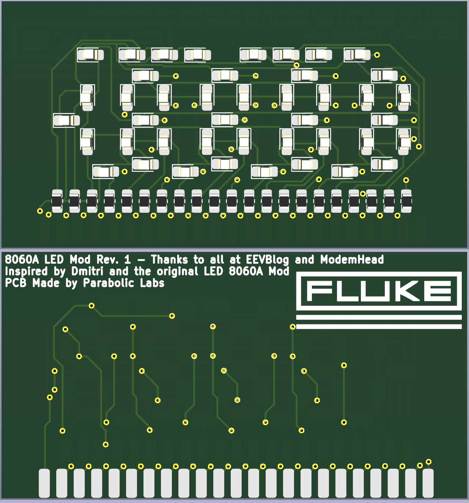

# Fluke 8060A LCD-to-LED Replacement Mod
## PCB for the Fluke 8060A's LCD but converted to LED.
### Inspired by Dmitri Faguet, ModemHead, ogdento, JdaleH, retiredcaps, DrTaylor, Dave and everyone else at EEVBlog.
Most work was done intermittently through 20/4/2023 - 8/2/2024. Finalized Rev 1 on 28/9/2024.

- The original PCB was made and it had 2 errors, layout of digits and missing pin 23.
-   I fixed both, rerouted the entire board and add the reuse of the original LCD elastomeric/zebra strip.

## Fluke 8060A is simply the best.
This is mostly a KiCAD project for the LED PCB, with some extra photos, PDFs, and various things related to the 8060A.

## Notes
Finalized the Rev 1 PCB. Will do BOM and assembly for PCBWay soon.

### 8060A LED Mod Rev 1

### Schematic

